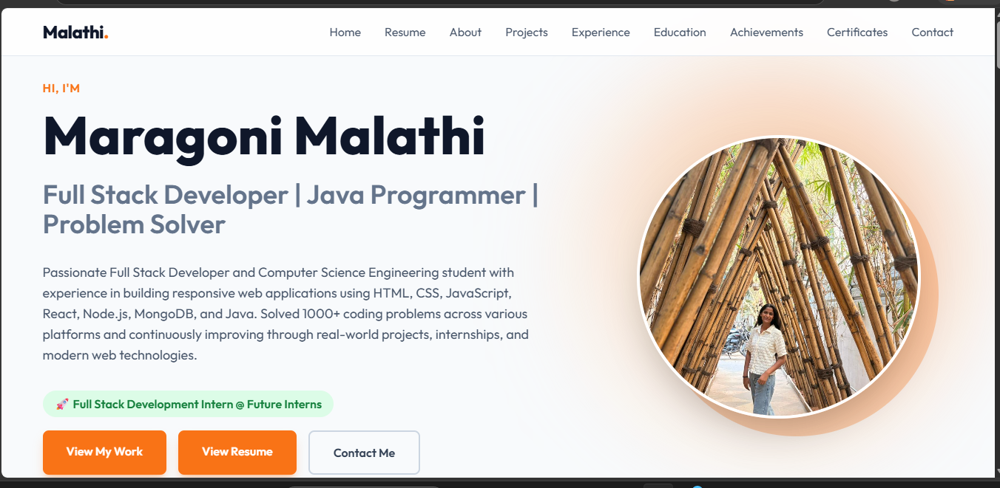
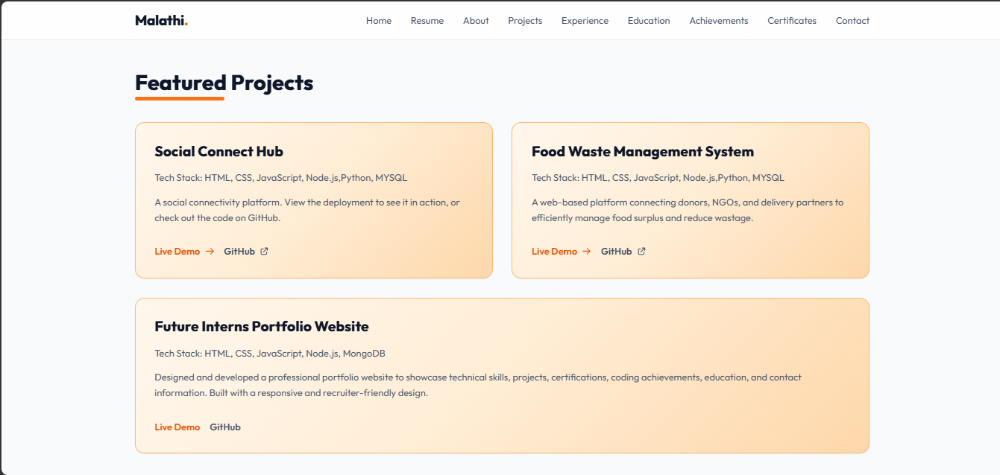

# Personal Portfolio Website

## Overview

This is my professional portfolio website developed as part of the Future Interns Full Stack Web Development Internship.

The website showcases:

* About Me
* Technical Skills
* Projects
* Internship Experience
* Education
* Coding Achievements
* Certifications
* Contact Information

## Technologies Used

* HTML5
* Tailwind CSS
* JavaScript
* GitHub Pages

## Live Website

https://malathi-maragoni.github.io/Portfolio/

## Features

* Responsive Design
* Resume Download
* Contact Form
* SEO Optimized
* Professional UI
* Project Showcase

## 📸 Screenshots

### Home Page

### Projects Section

### Contact Page

## Author

Maragoni Malathi
Full Stack Developer
